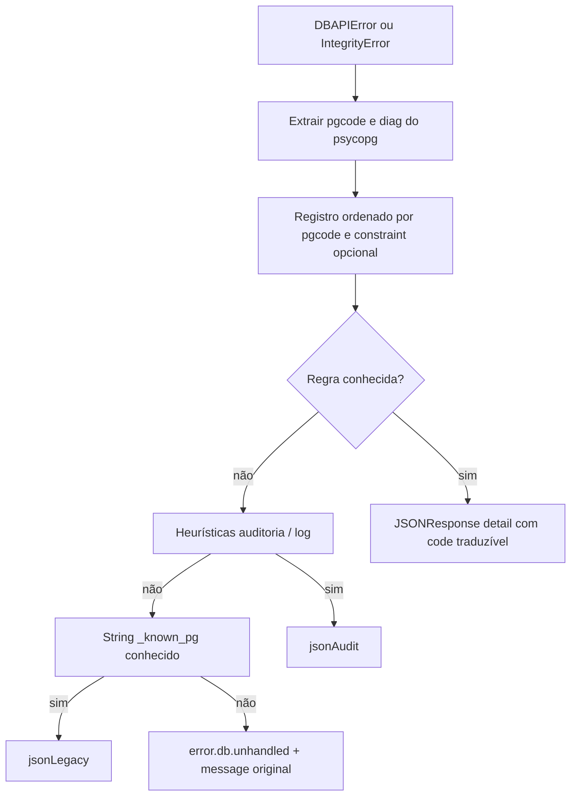

# Camada de erros do banco (PostgreSQL + i18n)

## Contexto

- Hoje, [`backend/src/valora_backend/main.py`](backend/src/valora_backend/main.py) trata `IntegrityError`/`DBAPIError` com heurísticas por **texto** (`_audit_tuple_from_message_text`, `_known_pg_tuple_from_message_text`). Erros não mapeados retornam 500 com `detail` string genérica (“Falha ao comunicar…”), que é o que a UI mostra.
- A política do repositório exige **código estável** no corpo da API e tradução no frontend ([`skills/implementation/i18n/policy.md`](../../skills/implementation/i18n/policy.md)); [`frontend/src/lib/api/parse-error-detail.ts`](../../frontend/src/lib/api/parse-error-detail.ts) já suporta `detail: { code, message }` via `parseErrorCode`.

## Abordagem (código primeiro, heurística só onde fizer sentido)

- **Prioridade 1 — SQLSTATE + metadados:** regras por `pgcode` e, quando útil, `diag.constraint_name` (ex.: `23503` + `result_formula_id_fkey`).
- **Prioridade 2 — Heurísticas atuais:** mensagens de auditoria / log (`_audit_tuple_from_message_text`, etc.) onde o produto usa `RAISE` com texto próprio.
- **Prioridade 3 — String legacy:** `_known_pg_tuple_from_message_text` até ser migrado para regras por código.

1. **Extrair sempre o SQLSTATE** a partir da cadeia SQLAlchemy → `orig` psycopg: `pgcode` / `sqlstate`. Opcionalmente: `diag.constraint_name`, `diag.table_name`, `diag.schema_name`.
2. **Registro extensível** (exemplos nesta fase):
   - `(pgcode="23503", constraint_name="result_formula_id_fkey")` → `code` estável `error.db.foreign_key_result_references_formula`, HTTP **409**.
   - Opcional: `23503` sem constraint específico → `error.db.foreign_key_violation` (409).
3. **Resposta mapeada:** `{"detail": {"code": "error.db....", "pg_code": "23503", "constraint": "..." }}`. Texto amigável só na UI via next-intl.

## Erros não mapeados (decisão de produto)

- **Não** usar mensagem genérica tipo “Falha ao comunicar com o banco…” como único texto para o usuário.
- O backend deve incluir sempre **`message`** com a **mensagem original** do PostgreSQL/driver (preferir uma linha principal estável, ex.: `diag.message_primary` do psycopg; se indisponível, `str(orig)` truncado de forma segura para evitar respostas gigantes).
- `code` estável: `error.db.unhandled` (ou nome equivalente), mais `pg_code` quando existir, para logs e evolução futura.
- A UI: helper que, para `error.db.unhandled` (ou ausência de chave i18n), **exibe `detail.message`** (original), não um texto genérico traduzido.
- **Nota:** mensagens brutas costumam estar em inglês e podem citar nomes de tabela/constraint; foi escolha explícita de transparência para o usuário.

## Frontend

- Chaves `error.db.*` apenas para códigos **mapeados** nesta fase (paridade `npm run check:i18n`).
- Helper (ex.: `resolveApiErrorUserMessage`): se `parseErrorCode` tiver tradução em `error.db.*`, usar `t(code)`; se `code === error.db.unhandled` ou chave ausente, usar **`parseErrorDetail` / `detail.message`** (mensagem original devolvida pela API).
- Ajustar fluxos que já usam `FormulaPersistError` e [`action-configuration-client.tsx`](../../frontend/src/component/configuration/action-configuration-client.tsx) para esse contrato.

## Testes

- `IntegrityError` simulado com `pgcode` + constraint mapeada → 409 e `detail.code` esperado.
- Erro não mapeado simulado → 500 (ou código acordado), `detail.code === error.db.unhandled`, `detail.message` não vazio com texto de origem.
- Regressão: teste de auditoria existente em [`backend/tests/test_main.py`](../../backend/tests/test_main.py).

## Extensão futura

- Docstring no módulo: como adicionar regra (`pgcode`, `constraint_name` opcional, `code`, `status_code`).
- Migrar respostas só-string de auditoria/legacy para `{ code, message? }` alinhado ao mesmo contrato, quando fizer sentido.

## Ficheiros principais

| Área | Ficheiros |
|------|-----------|
| Backend | Novo módulo em `backend/src/valora_backend/`; [`main.py`](../../backend/src/valora_backend/main.py) |
| Frontend | `frontend/messages/*.json`, `frontend/src/lib/api/`, componentes que exibem erro de API |

## Nomenclatura de códigos

- Chaves estáveis em inglês com prefixo `error.db.` (valor literal no JSON `detail.code`, espelhado nas chaves next-intl sob o namespace `error.db`).
