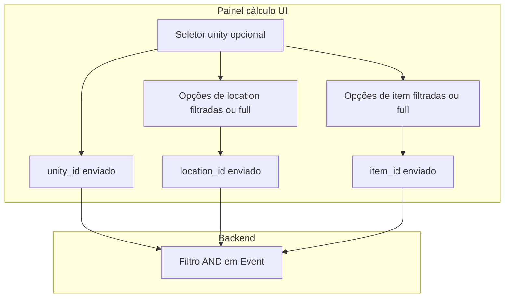

# Plano: unity, location e item como filtros no painel de cálculo

## O que foi entendido

- O **painel de cálculo** é a página [`frontend/src/app/[locale]/app/calculation/page.tsx`](frontend/src/app/[locale]/app/calculation/page.tsx) com o cliente [`frontend/src/component/calculation/current-age-calculation-client.tsx`](frontend/src/component/calculation/current-age-calculation-client.tsx).
- Hoje já existem filtros opcionais **location** e **item** (estado local + envio no JSON de `read-current-age`, `calculate-current-age`, `delete-current-age`). Valores vazios significam “sem filtro neste eixo”.
- No backend, o corpo [`ScopeCurrentAgeCalculationRequest`](backend/src/valora_backend/api/rules.py) tem só `moment_*`, `location_id` e `item_id`. Quando `location_id` ou `item_id` vêm preenchidos, a API expande para **subárvore** (descendentes) e aplica `Event.location_id.in_(...)` e/ou `Event.item_id.in_(...)` — ver por exemplo o fluxo em `calculate_scope_current_age` (linhas ~2641–2679).
- **Unity** ainda **não** entra nesse contrato. O pedido é tratar **unity** como filtro opcional de eventos, em linha com o painel de evento.

### Regra de produto (UI): unity influencia location e item

**Confirmado:** ao selecionar uma **unity**, os campos **location** e **item** não são listas independentes do diretório completo; devem mostrar **apenas as opções permitidas** para aquela unity, com o **mesmo comportamento** já implementado em [`event-configuration-client.tsx`](frontend/src/component/configuration/event-configuration-client.tsx):

- `filteredLocationItemList`: com unity selecionada, só nós da hierarquia de local que são a cadeia de ancestrais do `location_id` da unity (incluindo esse nó).
- `filteredItemItemList`: com unity selecionada, só itens na hierarquia alcançável a partir de `item_id_list` da unity (cada id permitido e seus ancestrais), para o seletor hierárquico fazer sentido.
- Ao **mudar** a unity: definir `locationId` para `record.location_id`; se o `itemId` atual não pertencer a `record.item_id_list`, limpar `itemId`.
- Com unity selecionada, o seletor de **local** fica **desabilitado** (o local efetivo do recorte é o da unity; evita combinações incoerentes na UI).

Sem unity selecionada, location e item continuam com o diretório completo do escopo, como hoje.

### Backend (sem mudança de intenção)

**Semântica de filtro (AND):**

- `unity_id` ausente: não filtra por unidade.
- `unity_id` presente: apenas eventos com `Event.unity_id == unity_id`.
- `location_id` / `item_id` opcionais como hoje (expansão para descendentes), em conjunto com unity quando enviados.

O frontend, com a cascata acima, tende a enviar `location_id` coerente com a unity quando há unity; o backend continua sendo a fonte de verdade e valida escopo.

## A abordagem é boa?

**Sim:** espelha o modelo (evento tem unity, local, item), evita escolhas impossíveis na UI e mantém o backend explícito com os três critérios.

**Cuidados:**

- **Extrair helper** em [`rules.py`](backend/src/valora_backend/api/rules.py) para o predicado de eventos (calculate/delete/read) ao acrescentar `unity_id`, por causa da ramificação atual em `delete_scope_current_age`.
- **Duplicação de lógica**: a lógica de `filteredLocationItemList` / `filteredItemItemList` + `onChange` da unity está hoje só no cliente de evento; para não divergir, preferir **extrair funções puras compartilhadas** (ex. módulo em `frontend/src/lib/...` ou componente hook) usadas por event e cálculo — só se o custo for aceitável; caso contrário, copiar com comentário apontando para a fonte canónica até haver extração.

## Implementação sugerida

### Backend

1. Estender `ScopeCurrentAgeCalculationRequest` com `unity_id: int | None = None`.
2. Validar com `_get_scope_unity_or_404` quando `unity_id` não for `None`.
3. Aplicar `Event.unity_id == unity_id` quando preenchido em `_list_scope_current_age_results`, `calculate_scope_current_age` e `delete_scope_current_age`.
4. Helper compartilhado para predicado de eventos (tempo + unity + location + item) em calculate e delete.
5. **Testes** em [`backend/tests/test_member_directory_api.py`](backend/tests/test_member_directory_api.py).

### Frontend

1. [`calculation/page.tsx`](frontend/src/app/[locale]/app/calculation/page.tsx): carregar diretório de unidades (como [`event/page.tsx`](frontend/src/app/[locale]/app/configuration/event/page.tsx)).
2. [`current-age-calculation-client.tsx`](frontend/src/component/calculation/current-age-calculation-client.tsx): props `initialUnityDirectory`; estado `unityId`; select de unity antes de local/item; **cascata obrigatória** alinhada a `event-configuration-client` (mema regra de listas filtradas, sync de `locationId`, desabilitar local com unity, limpar item inválido); incluir `unity_id` nos três corpos JSON.
3. **i18n** em `CalculationPage.panel` (pt-BR, en-US, es-ES): label/hint da unity como filtro de eventos; hints de location/item podem referir que, com unity, as opções são restritas.

### Rotas BFF

- Confirmar repasse do body em [`frontend/src/app/api/auth/tenant/current/scopes/[scopeId]/events/`](frontend/src/app/api/auth/tenant/current/scopes/[scopeId]/events/).
