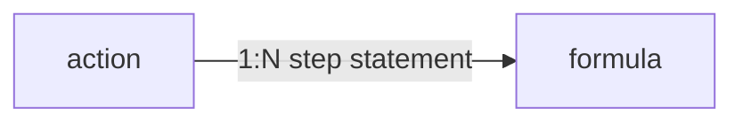

# Validação do modelo e plano do componente de fórmulas

## O que está correto no seu pedido

- **Cardonalidade 0..N:** Na tabela `formula`, cada registro tem `action_id` obrigatório; a própria tabela `action` no ERD documenta que pode haver uma ou mais fórmulas. Não há limite no schema além de `UNIQUE (action_id, step)`.
- **Campo de texto da fórmula:** O campo persistido é `statement` (TEXT), com comentário no ERD alinhado a tokens como `${field:…}` (vínculo lógico, não FK; ver [.cursor/plans/plan-sincronizar-bd-erd.md](plan-sincronizar-bd-erd.md)).
- **Lista + nova + marcar exclusão ao gravar:** Faz sentido com o padrão já usado no painel de ações ([action-configuration-client.tsx](../../frontend/src/component/configuration/action-configuration-client.tsx)) para exclusão da **ação** (`isDeletePending` até Salvar). A API de fórmulas hoje é **REST com commit imediato** (GET/POST/PATCH/DELETE em [rules.py](../../backend/src/valora_backend/api/rules.py) ~756–894); não existe endpoint “batch”. O comportamento “só apaga ao gravar o painel” é **estado local no cliente** + chamadas `DELETE` (e criações/edições) **no mesmo `handleSave`**, não uma mudança de contrato no backend.

### Exclusão de uma ou mais fórmulas (confirmado)

- Pode marcar **uma ou várias** fórmulas para exclusão (flags locais por id de fórmula existente).
- **Nada é apagado no servidor** ao só marcar; a remoção efetiva ocorre quando o utilizador clica em **Salvar** no painel da ação, nesse momento o cliente executa um `DELETE` por fórmula marcada (em sequência segura, juntamente com PATCH do nome da ação e restantes operações de fórmulas).
- **Cancelar** ou **desfazer** a marcação antes de Salvar volta ao estado anterior sem `DELETE`.

## O que precisa além do “campo da fórmula”

1. **Ordem sem campo `step` visível (drag-and-drop)**
  A API continua a exigir `step` no `POST` e aceita `step` no `PATCH` ([rules.py](../../backend/src/valora_backend/api/rules.py)); o banco impõe **unicidade por `(action_id, step)`**. A UI **não** mostra um input numérico de passo.
  - A lista de fórmulas é uma **sequência ordenável por arrastar e soltar** (cada linha: alça ou linha inteira, `textarea` para `statement`, ações de nova/remover conforme o plano).
  - A ordem na tela (de cima para baixo) define o `step` **apenas na persistência**: posição 1 → `step: 1`, etc. “Nova fórmula” entra no fim da lista até o usuário reordenar.
  - Ao **Salvar**, o cliente compara a ordem desejada com a do servidor e aplica `PATCH` de `step` (e/ou criações/exclusões) com a **estratégia de escrita segura** já descrita (evitar colisão de `UNIQUE` na sequência de PATCH).
  - **Acessibilidade:** além do ponteiro, considerar teclado ou botões “mover para cima/baixo” como reforço (opcional no primeiro corte, mas recomendável para WCAG).
  - **Implementação:** o repositório já tem copy de dicas de drag-and-drop em locais/unidades ([messages](../../frontend/messages/pt-BR.json)); para fórmulas pode reutilizar o tom. Se ainda não houver dependência DnD no `package.json`, avaliar `@dnd-kit/core` + `@dnd-kit/sortable` (padrão comum em React) ou padrão nativo HTML5, alinhado ao restante do frontend.
2. **Modo “Nova ação” (create)**
  Enquanto a ação não existir, **não há `action_id`**. Fórmulas não podem ser persistidas. Opções canónicas:
  - ocultar o card de fórmulas até existir ação salva, ou  
  - mostrar aviso e desabilitar “Nova fórmula” até o primeiro save da ação (POST em `/scopes/{scope_id}/actions`).
3. **Exclusão da ação vs fórmulas**
  No modelo, `formula.action_id` tem `ondelete="CASCADE"` para `action` ([rules.py](../../backend/src/valora_backend/model/rules.py)). Ao marcar exclusão da **ação** e confirmar, não é obrigatório apagar fórmulas manualmente no cliente; o servidor remove em cascata.
4. **Histórico / auditoria do painel**
  O painel atual usa `tableName: "action"` no bloco de histórico. Alterações em `formula` geram auditoria no backend (trigger em migrações), mas **não aparecerão** nesse histórico lateral até estender a UI para `formula` (opcional, fora do escopo mínimo do card).
5. **Integração frontend ainda inexistente**
  Não há referências a `formula` no app Next. Será necessário:
  - tipos (`ScopeFormulaRecord`, etc.) em [types.ts](../../frontend/src/lib/auth/types.ts) alinhados ao backend;
  - rotas BFF sob `app/api/auth/tenant/current/scopes/[scopeId]/actions/[actionId]/formulas/` (e `.../formulas/[formulaId]/`), no mesmo estilo de [actions/[actionId]/route.ts](../../frontend/src/app/api/auth/tenant/current/scopes/[scopeId]/actions/[actionId]/route.ts);
  - `fetch` no cliente para listar ao selecionar ação e para aplicar mudanças no Save.
6. **isDirty** e descarte
  Hoje `isDirty` considera nome da ação e `isDeletePending` ([action-configuration-client.tsx](../../frontend/src/component/configuration/action-configuration-client.tsx) ~293–295). Incluir rascunhos de fórmulas (novas, editadas, marcadas para exclusão) e resetar no `syncFromDirectory` / troca de seleção, no mesmo espírito dos outros editores de configuração.
7. **Conflitos de `step` ao gravar (inclui reordenação por DnD)**
  Reordenar no drag-and-drop altera os `step` desejados para todas as linhas afetadas. Uma sequência ingênua de `PATCH` pode gerar `IntegrityError` (“Duplicate step”). O `handleSave` deve definir **ordem de operações** (por exemplo: exclusões primeiro; depois renumerar com estratégia que evite colisão, por exemplo valores temporários ou fases em duas passagens; por fim POSTs de linhas novas). Vale tratar isso no desenho do `handleSave`, não só no componente visual.

## Diagrama resumido (dados)

## Referências rápidas

| Fonte | Conteúdo relevante |
|-------|---------------------|
| [backend/erd.json](../../backend/erd.json) | Tabela `formula`: `action_id`, `step`, `statement` |
| [backend/README.md](../../backend/README.md) | Menção a `.../actions/{action_id}/formulas` |
| [skills/implementation/rule-formula-simpleeval/SKILL.md](../../skills/implementation/rule-formula-simpleeval/SKILL.md) | Validação de `statement` com atribuição direta para `${field:id}`; o armazenamento atual continua sendo `step` + `statement` no banco |

## Conclusão

O plano de UI fixa **ordem por drag-and-drop** (sem campo `step` visível), comportamento no fluxo “Nova ação”, proxy API no frontend, `isDirty` + batch no Save (incluindo ordem segura de writes para `UNIQUE`), e opcionalmente **histórico por tabela `formula`**.
