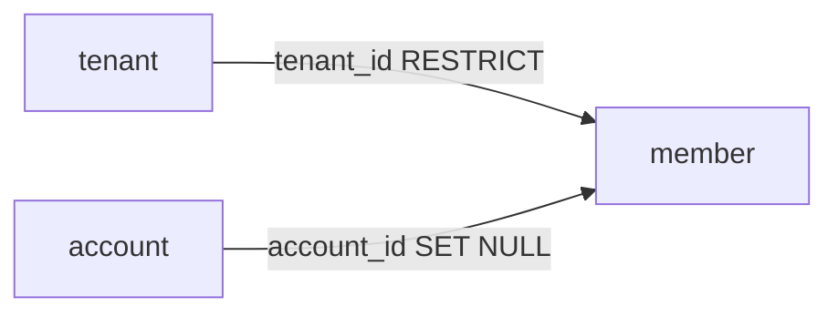

# Plano: criação do banco de dados (fase 1 — tenant, account, member)

**Cópia canónica no repositório.** Local: **`.cursor/plans/`** na raiz do monorepo (versionado no Git). Não usar a pasta `%USERPROFILE%\.cursor\plans\` do Cursor como fonte oficial — pode desligar-se ao mudar o caminho do workspace.

**Última revisão do estado:** ver secção [Estado de execução](#estado-de-execução).

---

## Estado de execução

| Bloco | Situação |
|-------|----------|
| A — Decisões de modelo (ERD) | Feito no ERD |
| B — Docker e config | Feito (`docker-compose.yml`, `config.py`, README backend, `.env.example` na raiz) |
| B' — Renomeação cleber → valora | Feito (incl. pasta local e GitHub) |
| C — SQLAlchemy | Pendente |
| D — Alembic | Pendente |
| E — Validação | Pendente |

---

## Decisões importantes (resumo)

- **Fonte de verdade do schema:** [backend/erd/erd.json](../../backend/erd/erd.json) (drawDB / PostgreSQL).
- **Stack:** [architecture/technology-stack.md](../../architecture/technology-stack.md) — FastAPI, SQLAlchemy, Alembic, PostgreSQL, `psycopg`, `pydantic-settings`.
- **Fase 1:** apenas tabelas `tenant`, `account`, `member`; restantes tabelas do ERD ficam para migrations posteriores.
- **Tipos:** PKs e FKs de identity em **BIGINT** (alinhado no ERD).
- **Postgres em desenvolvimento:** Docker Compose na raiz do monorepo; base de dados **`valora`**, utilizador **`valora`**; a senha define-se só no ficheiro **`.env`** local (variável **`POSTGRES_PASSWORD`**, ver `.env.example` na raiz); `Settings` monta a URL a partir desta variável (nada de credenciais no Git).
- **Pacote Python:** `valora_backend` (antes `cleber_backend`).
- **Planos do projeto:** criar e manter ficheiros Markdown em **`.cursor/plans/`** (este repositório), com commit no Git.

---

## Escopo desta fase

- **Inclui:** Postgres local de desenvolvimento via **Docker Compose**; apenas as tabelas `tenant`, `account` e `member`, com FKs, `CHECK`, índice único parcial e comentários descritos no ERD.
- **Fora do escopo (fases futuras):** `scope`, `kind`, `location`, `item`, `segment`, `event`, `scenario`, `version`, `attribute`, `fact`.
- **Backend:** [backend/src/valora_backend/main.py](../../backend/src/valora_backend/main.py) — Alembic ainda não inicializado até concluir o bloco D.

---

## Modelo alvo (resumo do ERD)

| Tabela | Colunas principais |
|--------|-------------------|
| **tenant** | `id` (PK, BIGINT, serial), `name`, `display_name` (TEXT, NOT NULL) |
| **account** | `id` (PK, BIGINT, serial), `name`, `display_name`, `email`, `provider` (TEXT, NOT NULL) |
| **member** | `id` (PK, BIGINT, serial), `name`, `display_name` (TEXT, nullable), `email` (TEXT, NOT NULL), `tenant_id` (BIGINT, NOT NULL), `account_id` (BIGINT, nullable), `status` (INTEGER, NOT NULL) |

**Constraints em `member` (ERD → espelhar na migration / SQLAlchemy)**

- `CHECK (status IN (1, 2, 3))`
- `member_name_empty`: `status = 2 OR name IS NOT NULL`
- `member_display_name_empty`: `status = 2 OR display_name IS NOT NULL`
- `member_unique_tenant_account`: índice único parcial `UNIQUE (tenant_id, account_id) WHERE account_id IS NOT NULL`

**Relações**

- `member.tenant_id` → `tenant.id`: `ON UPDATE CASCADE`, `ON DELETE RESTRICT`
- `member.account_id` → `account.id`: `ON UPDATE CASCADE`, `ON DELETE SET NULL`

**Opcional em fase futura**

- `UNIQUE (provider, email)` em `account` se a regra de login exigir.

---

## Etapas (checkboxes)

Marque cada item quando aprovar / concluir.

### A — Decisões de modelo

- [x] **A.1** Tipos BIGINT — alinhado no ERD.
- [x] **A.2** UNIQUE parcial `(tenant_id, account_id)` — alinhado no ERD.
- [x] **A.3** Comentários e constraints de `member` — alinhado no ERD.

### B — Docker, configuração e infraestrutura

**Ideia:** o PostgreSQL de desenvolvimento roda em **container** (Compose). O backend e o Alembic, executados na máquina de desenvolvimento, obtêm a URL do banco a partir de **`POSTGRES_PASSWORD`** no `.env` local (montada em `Settings.database_url`), com host **localhost** (ou `127.0.0.1`) e **porta mapeada** pelo Compose (no host: **5434** → 5432 no container). Se no futuro o backend também rodar em container na mesma rede do Compose, o host passa a ser o **nome do serviço** do Postgres no `docker-compose.yml`.

- [x] **B.1** `docker-compose.yml` na raiz do monorepo com serviço PostgreSQL, volume, healthcheck, porta, variáveis `POSTGRES_*`.
- [x] **B.2** Módulo `backend/src/valora_backend/config.py` com `pydantic-settings` e `POSTGRES_PASSWORD` → `database_url`.
- [x] **B.3** Documentação em [backend/README.md](../../backend/README.md), [`.env.example`](../../.env.example) na raiz e `backend/.env.example`.

### B' — Renomeação do projeto (cleber → valora)

- [x] **B'.1** Backend: pacote `valora_backend`, `pyproject.toml` atualizado.
- [x] **B'.2** Frontend: `package.json` (`valora-frontend`).
- [x] **B'.3** Conteúdo: README, ERD title, `main.py`, mockups, `archive/review/plano-ajustado.md`.
- [x] **B'.4** Pasta local: commit → fechar workspace → renomear pasta (ex.: `cleber` → `valora`) → reabrir.
- [x] **B'.5** GitHub: renomear repositório; `git remote set-url origin …` se necessário.

**Ordem sugerida:** B'.1–B'.3 (feito no repo) → commit → B'.4 → B'.5 (**B'.1–B'.5 concluídos**).

### C — SQLAlchemy (só as 3 tabelas)

- [ ] **C.1** Criar `Base` declarativo e pacote de modelos (ex.: `backend/src/valora_backend/model/identity.py`).
- [ ] **C.2** Mapear `Tenant`, `Account`, `Member` com **BigInteger** nas PKs/FKs conforme ERD.
- [ ] **C.3** FKs: `member.tenant_id` (RESTRICT delete, CASCADE update); `member.account_id` (SET NULL delete, CASCADE update).
- [ ] **C.4** `CheckConstraint` para `status IN (1,2,3)` e para `member_name_empty` / `member_display_name_empty`.
- [ ] **C.5** Índice único parcial PostgreSQL para `(tenant_id, account_id)` onde `account_id IS NOT NULL` (`postgresql_where` no SQLAlchemy).
- [ ] **C.6** `comment` em tabelas/colunas alinhado ao ERD.

### D — Alembic

- [ ] **D.1** `alembic init` em `backend/`; não commitar URL sensível no `alembic.ini`.
- [ ] **D.2** `alembic/env.py`: `target_metadata = Base.metadata`, importar modelos; `DATABASE_URL` do ambiente.
- [ ] **D.3** `alembic revision --autogenerate -m "tenant account member"` e **revisar** o script (CHECKs, índice parcial, FKs).
- [ ] **D.4** `alembic upgrade head` em desenvolvimento e conferir schema.

### E — Validação e encerramento da fase 1

- [ ] **E.1** Conferir no banco: 3 tabelas, PKs, FKs, ON DELETE/UPDATE, todos os CHECKs, índice único parcial.
- [ ] **E.2** (Opcional) `engine` / `session` + dependency FastAPI em `db.py`.

---

## Diagrama desta fase

---

## Próximas fases (referência)

- Incluir `scope` e demais tabelas do ERD em migrations incrementais (PKs/FKs já BIGINT no ERD onde aplicável).
