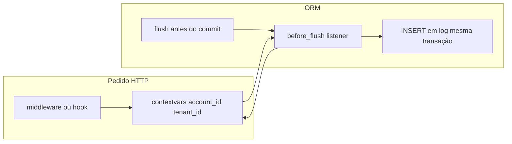

# Plano: auditoria via eventos de sessão SQLAlchemy + contextvars

## Objetivo

Alimentar a tabela [`log`](backend/src/valora_backend/model/log.py) automaticamente em todo `INSERT` / `UPDATE` / `DELETE` feito **via ORM** nas tabelas monitoradas pelo `CHECK` de `table_name`, **sem** gravar eventos sobre a própria tabela `log`.

## Estado atual relevante

- ERD [`backend/erd.json`](backend/erd.json): coluna `log.row` com `notNull: false` e comentário *"NULL em caso de delete"*; o restante do payload continua a ser JSONB.
- Modelo [`Log`](backend/src/valora_backend/model/log.py): `row_payload` mapeado para `row`, **nullable**; `CheckConstraint` `log_row_payload_by_action_chk`: se `action_type = 'D'` então `row IS NULL`; se `action_type IN ('I','U')` então `row IS NOT NULL`. Migração [`c7d9e1f3a2b4_log_row_null_on_delete.py`](backend/alembic/versions/c7d9e1f3a2b4_log_row_null_on_delete.py).
- Campos restantes: `account_id`, `tenant_id`, `table_name`, `action_type`, `moment_utc` (default no servidor).
- Sessão: [`get_session`](backend/src/valora_backend/db.py) por pedido; commits mistos entre [`commit_session_with_null_if_empty`](backend/src/valora_backend/model/null_if_empty.py) e `session.commit()` direto em [`auth.py`](backend/src/valora_backend/api/auth.py).
- Identidade HTTP: JWT com `sub` (account) e `tenant_id` quando o utilizador já escolheu tenant — ver [`get_current_member`](backend/src/valora_backend/auth/dependencies.py).

## Abordagem

1. **Contexto de auditoria (`contextvars`)**  
   Estrutura imutável ou dataclass leve (ex.: `account_id: int | None`, `tenant_id: int | None`) guardada em `ContextVar`.  
   - **Preenchimento:** preferir **middleware ASGI** (ou dependência global executada cedo) que leia o header `Authorization`, valide o token com a mesma lógica já usada em [`verify_token`](backend/src/valora_backend/auth/jwt.py) e extraia `sub` e `tenant_id` **sem** exigir `Member` ativo — alinhado ao facto de `log` referir `account_id`, não `member_id`.  
   - **Sem token ou payload incompleto:** deixar contexto vazio; o listener **não** cria linhas `log` (evita violar `NOT NULL` e evita atribuir ação a utilizador desconhecido). Documentar este comportamento.

2. **Listener `before_flush` na classe `Session`**  
   Registar uma única vez (ex.: no arranque da app em [`create_app`](backend/src/valora_backend/main.py) / lifespan, ou ao importar um módulo `audit` carregado por `main`).

   Comportamento:

   - **Reentrância:** usar `ContextVar` booleano `audit_processing` (ou flag na sessão `info`) para ignorar flushes recursivos disparados ao adicionar instâncias `Log`.
   - **Iteração:** trabalhar sobre cópias de `session.new`, `session.dirty`, `session.deleted` no início do handler, ou ignorar instâncias `isinstance(obj, Log)`.
   - **Escopo de tabelas:** só auditar se `obj.__tablename__` estiver no conjunto permitido pelo ERD (`tenant`, `account`, `member`, `scope`, `location`, `unity`).
   - **Ações:**  
     - `new` e não era persistente antes → `action_type = 'I'`, `row_payload` = snapshot serializável da linha (obrigatório, não nulo).  
     - `dirty` → `action_type = 'U'`, `row_payload` = snapshot **após** alterações em memória (estado que vai ser persistido; não nulo).  
     - `deleted` → `action_type = 'D'`, `row_payload = None` (**NULL** na coluna `row`), coerente com o ERD e com `log_row_payload_by_action_chk`; **não** usar `{}` em deletes, senão o `INSERT` em `log` falha.  
   - **Uma linha `Log` por entidade afetada** por flush (simples); opcional futuro: agrupar ou filtrar colunas.

3. **Serialização para JSONB**  
   Função dedicada (ex.: `entity_to_audit_dict(instance) -> dict`) usando `sqlalchemy.inspect`, valores escalares, conversão de `datetime` para ISO string, `Decimal` para string ou float conforme política, relações **não** expandir por defeito (só colunas mapeadas na tabela) para evitar explosão de tamanho e ciclos. Só aplica a ações `'I'` e `'U'`; para `'D'` não chamar — persistir `NULL`.

4. **Integração com `null_if_empty`**  
   O `before_flush` corre antes do flush dentro de `commit()`; [`normalize_session_null_if_empty`](backend/src/valora_backend/model/null_if_empty.py) altera estado **antes** de `commit`. Ordem natural: se `normalize_*` for chamado antes de `commit`, o flush vê já o estado normalizado — o log reflete o que vai para a BD. **Não** é obrigatório alterar `commit_session_with_null_if_empty` se o listener estiver na `Session` global.

5. **Rotas públicas e `/health`**  
   Sem contexto → sem `log`; aceitável.

6. **Casos especiais (documentar no código)**  
   - Operações com `account` válido mas **sem** `tenant_id` no JWT: hoje `tenant_id` em `log` é `NOT NULL` — ou não auditar, ou **fase 2:** derivar `tenant_id` só a partir da entidade alterada (ex.: `member.tenant_id`, `scope.tenant_id`) com regras claras para não falsificar atores.  
   - Convites / `Member` com `account_id` nulo: quem “age” no sistema pode ser só backend; se não houver `account_id` no contexto, manter política “não gravar log” ou definir conta de serviço (fora do âmbito mínimo deste plano).

## Ficheiros previstos (implementação futura)

| Área | Caminho sugerido |
|------|-------------------|
| Contexto + API pública | `backend/src/valora_backend/audit/context.py` |
| Snapshot + listener | `backend/src/valora_backend/audit/session_listener.py` |
| Middleware JWT → context | `backend/src/valora_backend/audit/middleware.py` ou extensão de `main.py` |
| Registo do listener | `main.py` (`lifespan` startup) ou `db.py` após `SessionLocal` |

Manter nomes técnicos em inglês nos módulos; comentários em português do Brasil.

## Testes

- **Unitário:** listener com `Session` em memória (SQLite de teste) ou Postgres: verificar que um `add`/`delete` gera `Log` quando contextvars preenchidos; que em **`action_type == 'D'`** o campo `row` fica **NULL**; que `'I'`/`'U'` têm `row` não nulo; que `Log` não gera segundo log; que tabela fora da lista não gera entrada.  
- **Atenção:** `JSONB` é específico de PostgreSQL; testes que usam SQLite podem precisar de engine Postgres (fixture existente) ou mock do tipo na metadata só em testes — avaliar o padrão actual em [`test_member_directory_api.py`](backend/tests/test_member_directory_api.py).

## Checklist de implementação

- [ ] Criar pacote ou módulos `audit` com `contextvars` e funções `set_audit_context` / `clear_audit_context` (úteis em testes).
- [ ] Implementar middleware (ou equivalente) que preenche contexto a partir do Bearer JWT.
- [ ] Implementar `before_flush` com proteção à reentrância e filtro de tabelas.
- [ ] Implementar serialização segura para JSON.
- [ ] Registar listener no arranque da aplicação.
- [ ] Testes cobrindo com e sem contexto, exclusão de `log`, e regra **delete → `row` NULL** (incompatível com payload `{}`).
- [ ] Documentar em comentário curto: quando a auditoria é omitida.

## Referências no repositório

- [backend/erd.json](backend/erd.json) (entidade `log`, campo `row`)  
- [backend/alembic/versions/c7d9e1f3a2b4_log_row_null_on_delete.py](backend/alembic/versions/c7d9e1f3a2b4_log_row_null_on_delete.py)  
- [backend/src/valora_backend/model/log.py](backend/src/valora_backend/model/log.py)  
- [backend/src/valora_backend/db.py](backend/src/valora_backend/db.py)  
- [backend/src/valora_backend/auth/dependencies.py](backend/src/valora_backend/auth/dependencies.py)  
- [backend/src/valora_backend/main.py](backend/src/valora_backend/main.py)
