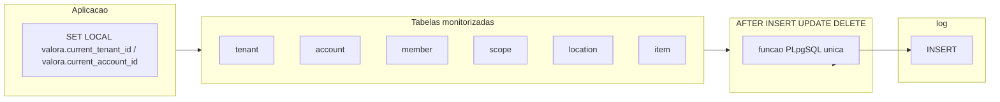

# Plano: triggers de auditoria para a tabela `log`

## Contexto (ERD e modelo)

- Em [`backend/erd.json`](backend/erd.json), a tabela `log` tem `account_id`, `tenant_id` (nullable, FK com `Set null`), `table_name` (CHECK nas seis tabelas), `action_type` (`I`/`U`/`D`), `row` (JSONB, **NULL em delete**, alinhado a [`c7d9e1f3a2b4_log_row_null_on_delete.py`](backend/alembic/versions/c7d9e1f3a2b4_log_row_null_on_delete.py)) e `moment_utc`.
- Tabelas cobertas pelo CHECK `log_table_name_chk`: **`tenant`**, **`account`**, **`member`**, **`scope`**, **`location`**, **`item`** — são exatamente as que precisam de trigger (não colocar trigger em `log` para evitar recursão).
- **`tenant_id` e `account_id` no registo de log**: preenchidos **exclusivamente** a partir de variáveis de sessão definidas com **`SET LOCAL`** na transação corrente. O trigger **não** deriva `tenant_id` a partir de colunas da linha (`member.tenant_id`, `scope`, etc.) nem usa `member.account_id` como ator — evita divergência entre “contexto do pedido” e o JSON da linha e mantém um único contrato para todas as tabelas monitorizadas.

## Abordagem recomendada (uma função + seis triggers)

1. **Uma única função** `LANGUAGE plpgsql` (nome estável, ex.: `valora_audit_row_to_log`) acoplada a **seis triggers** `AFTER INSERT OR UPDATE OR DELETE` (um por tabela), `FOR EACH ROW`.
2. **Payload `row`**: para `INSERT`/`UPDATE`, serializar a linha nova com `row_to_json(NEW)::jsonb` (compatível com **PostgreSQL 17**, imagem em [`docker-compose.yml`](docker-compose.yml)). Para `DELETE`, **`row` = NULL** (obrigatório pelo CHECK `log_row_payload_by_action_chk`).
3. **`action_type`**: mapear `TG_OP` → `'I'`, `'U'`, `'D'`.
4. **`tenant_id` e `account_id`**: ler com `current_setting('valora.current_tenant_id', true)` e `current_setting('valora.current_account_id', true)`, com **cast seguro para `bigint`** (tratar string vazia / setting ausente como `NULL`). Valores inválidos: política explícita na skill (falhar a transação vs. gravar `NULL`); recomendação: **validar no backend** antes do `SET LOCAL` para não depender de exceções dentro do trigger.
5. **Ordem na migration**: `CREATE FUNCTION` antes dos `CREATE TRIGGER`; no downgrade, `DROP TRIGGER` em cada tabela e depois `DROP FUNCTION`.
6. **Segurança e desempenho**: triggers `AFTER` não bloqueiam a validação da linha; custo extra de um `INSERT` em `log` por mutação. Não há recursão se **`log`** não tiver trigger.

## Integração com a aplicação (**obrigatória** para contexto completo)

- Em cada transação que executar escrita nas tabelas monitorizadas, a aplicação deve correr **`SET LOCAL`** (no mesmo `Connection` / antes do `commit`):
  - `SET LOCAL valora.current_tenant_id = '<id>'` — tenant do contexto do pedido (ou omitir / não definir se a operação for realmente sem tenant, p.ex. fluxo global só em `account`, caso em que `tenant_id` no log fica `NULL` se o setting não estiver definido).
  - `SET LOCAL valora.current_account_id = '<id>'` — conta autenticada que realiza a ação.
- Implementação típica: listener `connection_connect` / `before_cursor_execute` no **primeiro uso da conexão na transação**, ou `session.begin()` / evento de sessão SQLAlchemy em [`backend/src/valora_backend/db.py`](backend/src/valora_backend/db.py) + dependências FastAPI (`get_current_account`, `get_current_tenant`) para obter os IDs e emitir os dois `SET LOCAL` em sequência.
- **`SET LOCAL`** garante que os valores **não vazam** para outras transações na mesma sessão de pool e são revertidos no `ROLLBACK`.
- **Criação de `tenant` novo**: o backend deve definir `valora.current_tenant_id` de forma coerente com o produto (p.ex. após obter o `id` gerado, numa segunda transação, ou definir o setting antes do `INSERT` se o fluxo fixar o id por sequência — documentar o fluxo escolhido na skill).

## Testes

- Testes de integração com PostgreSQL: no mesmo `connection`, executar os dois `SET LOCAL` e depois `INSERT`/`UPDATE`/`DELETE` numa tabela monitorizada; assertar `log.tenant_id`, `log.account_id`, `table_name`, `action_type`, `row` (e `NULL` em delete).
- Caso sem `SET LOCAL`: assertar que `tenant_id`/`account_id` no log ficam `NULL` (comportamento esperado para migrações ou jobs sem contexto).

## Atualização de skills e documentação

- Criar [`.cursor/skills/audit-log-triggers/SKILL.md`](.cursor/skills/audit-log-triggers/SKILL.md) com:
  - Lista canónica das tabelas monitorizadas (alinhada a [`log.py`](backend/src/valora_backend/model/log.py) e [`backend/erd.json`](backend/erd.json)).
  - **Contrato obrigatório:** nomes exatos dos GUCs (`valora.current_tenant_id`, `valora.current_account_id`), uso de **`SET LOCAL`**, formato (string numérica castável a `bigint`), e ordem recomendada (definir antes das mutações).
  - Passos para **nova tabela** no futuro: (1) incluir nome em `log_table_name_chk` (migration + modelo + `erd.json`); (2) `CREATE TRIGGER` apontando para a mesma função (sem ramo extra para `tenant_id`/`account_id` na função — só `TG_TABLE_NAME` para `table_name` e serialização da linha); (3) teste de integração.
  - Referência ao **PostgreSQL 17** e comentários em português do Brasil no SQL quando aplicável.
- Na skill [`export-erd-drawdb/SKILL.md`](.cursor/skills/export-erd-drawdb/SKILL.md): parágrafo curto a apontar para **audit-log-triggers** quando a lista de tabelas em `log` / `log_table_name_chk` mudar.

## Ficheiros principais a tocar

| Área | Ficheiro |
|------|----------|
| Migration nova (head atual: [`f1e2d3c4b5a6`](backend/alembic/versions/f1e2d3c4b5a6_log_tenant_account_nullable_fk.py)) | `backend/alembic/versions/<novo>_audit_triggers_log.py` |
| Wiring **obrigatório** `SET LOCAL` | [`backend/src/valora_backend/db.py`](backend/src/valora_backend/db.py) e/ou camada que abre a sessão por pedido |
| Testes | `backend/tests/...` |
| Skills | nova `audit-log-triggers` + ajuste mínimo em `export-erd-drawdb/SKILL.md` |

## Alternativas (e por que não são “melhores” aqui)

- **Derivar `tenant_id` da linha no trigger**: mais “automático”, mas contradiz o requisito de usar **`SET LOCAL`** para `tenant_id` e `account_id` de forma uniforme e explícita.
- **Só ORM (events SQLAlchemy)**: não cobre SQL cru nem outros clientes; triggers no PG alinham com [`architecture/system-principles.md`](architecture/system-principles.md).
- **`GENERATED` / DEFAULT na tabela `log`**: não substitui o trigger na tabela de origem.
